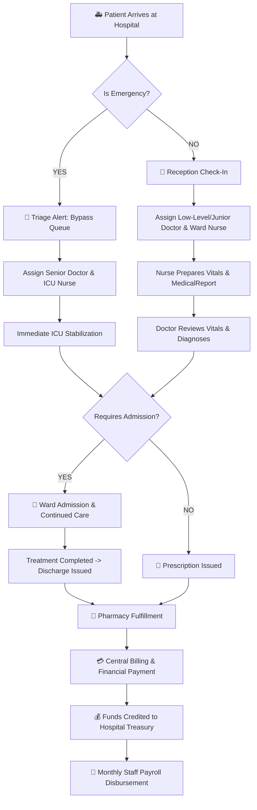
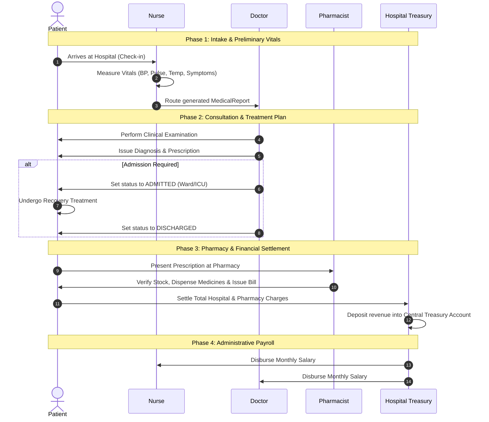

# 🏥 Hospital Management System

> A robust, role-based Java application engineered with Object-Oriented Programming (OOP) principles, custom exception handling, interface-driven workflows, and automated object serialization persistence.

[](https://www.oracle.com/java/)
[](LICENSE)

---


## 🔄 Real-Time Patient Lifecycle & Status Tracker

<svg xmlns="http://www.w3.org/2000/svg" viewBox="0 0 1350 480" width="100%">
  <defs>
    <linearGradient id="bgGrad" x1="0%" y1="0%" x2="100%" y2="100%">
      <stop offset="0%" stop-color="#090d16" />
      <stop offset="50%" stop-color="#0f172a" />
      <stop offset="100%" stop-color="#1e293b" />
    </linearGradient>

    <linearGradient id="cardGrad" x1="0%" y1="0%" x2="0%" y2="100%">
      <stop offset="0%" stop-color="#1e293b" />
      <stop offset="100%" stop-color="#0f172a" />
    </linearGradient>

    <filter id="glow" x="-30%" y="-30%" width="160%" height="160%">
      <feGaussianBlur stdDeviation="6" result="blur" />
      <feComposite in="SourceGraphic" in2="blur" operator="over" />
    </filter>

    <filter id="subtleGlow" x="-20%" y="-20%" width="140%" height="140%">
      <feGaussianBlur stdDeviation="3" result="blur" />
      <feComposite in="SourceGraphic" in2="blur" operator="over" />
    </filter>
  </defs>

  <style>
    .header-title { font-family: system-ui, -apple-system, sans-serif; font-weight: 800; fill: #38bdf8; font-size: 22px; letter-spacing: 1.5px; }
    .header-sub { font-family: system-ui, -apple-system, sans-serif; font-weight: 500; fill: #94a3b8; font-size: 15px; }
    .card-title { font-family: system-ui, -apple-system, sans-serif; font-weight: 700; fill: #ffffff; font-size: 18px; }
    .card-desc { font-family: system-ui, -apple-system, sans-serif; font-weight: 500; fill: #cbd5e1; font-size: 14px; }
    .status-label { font-family: system-ui, -apple-system, sans-serif; font-weight: 800; font-size: 12px; letter-spacing: 0.8px; }
    .legend-text { font-family: system-ui, -apple-system, sans-serif; font-weight: 600; fill: #e2e8f0; font-size: 14px; }

    .flow-line { stroke: #0284c7; stroke-width: 4; stroke-dasharray: 10, 10; animation: dash 1.5s linear infinite; }
    .emergency-line { stroke: #ef4444; stroke-width: 4; stroke-dasharray: 10, 10; animation: dash 0.9s linear infinite; }

    @keyframes dash { to { stroke-dashoffset: -20; } }

    .pulse-blue { animation: pulseBlue 2s infinite; }
    .pulse-amber { animation: pulseAmber 2s infinite; }
    .pulse-purple { animation: pulsePurple 2s infinite; }
    .pulse-emerald { animation: pulseEmerald 2s infinite; }

    @keyframes pulseBlue { 0%, 100% { fill: #0284c7; } 50% { fill: #38bdf8; } }
    @keyframes pulseAmber { 0%, 100% { fill: #d97706; } 50% { fill: #fbbf24; } }
    @keyframes pulsePurple { 0%, 100% { fill: #7e22ce; } 50% { fill: #c084fc; } }
    @keyframes pulseEmerald { 0%, 100% { fill: #059669; } 50% { fill: #34d399; } }

    .patient-tracker { fill: #38bdf8; filter: url(#glow); animation: trackPatient 8s cubic-bezier(0.4, 0, 0.2, 1) infinite; }
    .emergency-tracker { fill: #f87171; filter: url(#glow); animation: trackEmergency 8s cubic-bezier(0.4, 0, 0.2, 1) infinite; }

    @keyframes trackPatient {
      0%   { transform: translate(0px, 0px); opacity: 0; }
      5%   { opacity: 1; }
      20%  { transform: translate(220px, 0px); }
      40%  { transform: translate(440px, 0px); }
      60%  { transform: translate(660px, 0px); }
      80%  { transform: translate(880px, 0px); }
      95%  { transform: translate(1100px, 0px); opacity: 1; }
      100% { transform: translate(1100px, 0px); opacity: 0; }
    }

    @keyframes trackEmergency {
      0%   { transform: translate(0px, 0px); opacity: 0; }
      10%  { opacity: 1; }
      50%  { transform: translate(440px, -110px); opacity: 1; }
      90%  { transform: translate(440px, -110px); opacity: 0; }
      100% { transform: translate(0px, 0px); opacity: 0; }
    }
  </style>

  <rect width="1350" height="480" rx="20" fill="url(#bgGrad)" stroke="#334155" stroke-width="2.5"/>

  <text x="40" y="48" class="header-title">REAL-TIME PATIENT LIFECYCLE AND STATUS TRACKER</text>
  <text x="40" y="75" class="header-sub">Automated state transitions from patient intake to treatment, pharmacy fulfillment, and discharge</text>

  <g transform="translate(860, 35)">
    <circle cx="0" cy="0" r="6" fill="#38bdf8" />
    <text x="15" y="5" class="legend-text">Standard Routine Flow</text>
    <circle cx="210" cy="0" r="6" fill="#f87171" />
    <text x="225" y="5" class="legend-text">Emergency Bypass Arc</text>
  </g>

  <line x1="130" y1="260" x2="1230" y2="260" class="flow-line" />
  <path d="M 130 260 Q 350 110 570 260" fill="transparent" class="emergency-line" />

  <circle cx="130" cy="260" r="9" class="patient-tracker" />
  <circle cx="130" cy="260" r="8" class="emergency-tracker" />

  <g transform="translate(40, 170)">
    <rect width="180" height="180" rx="16" fill="url(#cardGrad)" stroke="#0284c7" stroke-width="2" filter="url(#subtleGlow)"/>
    <text x="20" y="42" font-size="28">🚑</text>
    <text x="65" y="42" class="card-title">1. Intake</text>
    <text x="20" y="75" class="card-desc">Patient Arrives</text>
    <text x="20" y="98" class="card-desc">Triage Assessment</text>
    <rect x="18" y="125" width="144" height="32" rx="8" class="pulse-blue" />
    <text x="28" y="146" class="status-label" fill="#ffffff">STATUS: CHECKED_IN</text>
  </g>

  <g transform="translate(260, 170)">
    <rect width="180" height="180" rx="16" fill="url(#cardGrad)" stroke="#d97706" stroke-width="2" filter="url(#subtleGlow)"/>
    <text x="20" y="42" font-size="28">👩‍⚕️</text>
    <text x="65" y="42" class="card-title">2. Nurse</text>
    <text x="20" y="75" class="card-desc">Measure Vitals</text>
    <text x="20" y="98" class="card-desc">Write Medical Report</text>
    <rect x="18" y="125" width="144" height="32" rx="8" class="pulse-amber" />
    <text x="24" y="146" class="status-label" fill="#ffffff">STATUS: UNDER_CHECKUP</text>
  </g>

  <g transform="translate(480, 170)">
    <rect width="180" height="180" rx="16" fill="url(#cardGrad)" stroke="#a855f7" stroke-width="2.5" filter="url(#glow)"/>
    <text x="20" y="42" font-size="28">👨‍⚕️</text>
    <text x="65" y="42" class="card-title">3. Doctor</text>
    <text x="20" y="75" class="card-desc">Review Report</text>
    <text x="20" y="98" class="card-desc">Prescribe and Admit</text>
    <rect x="18" y="125" width="144" height="32" rx="8" class="pulse-purple" />
    <text x="20" y="146" class="status-label" fill="#ffffff">STATUS: IN_TREATMENT</text>
  </g>

  <g transform="translate(700, 170)">
    <rect width="180" height="180" rx="16" fill="url(#cardGrad)" stroke="#059669" stroke-width="2" filter="url(#subtleGlow)"/>
    <text x="20" y="42" font-size="28">💊</text>
    <text x="65" y="42" class="card-title">4. Pharmacy</text>
    <text x="20" y="75" class="card-desc">Verify Prescription</text>
    <text x="20" y="98" class="card-desc">Dispense Medicines</text>
    <rect x="18" y="125" width="144" height="32" rx="8" fill="#059669"/>
    <text x="32" y="146" class="status-label" fill="#ffffff">STATUS: FULFILLED</text>
  </g>

  <g transform="translate(920, 170)">
    <rect width="180" height="180" rx="16" fill="url(#cardGrad)" stroke="#eab308" stroke-width="2" filter="url(#subtleGlow)"/>
    <text x="20" y="42" font-size="28">💳</text>
    <text x="65" y="42" class="card-title">5. Billing</text>
    <text x="20" y="75" class="card-desc">Settle Medical Bill</text>
    <text x="20" y="98" class="card-desc">Deposit Treasury</text>
    <rect x="18" y="125" width="144" height="32" rx="8" fill="#ca8a04"/>
    <text x="34" y="146" class="status-label" fill="#ffffff">STATUS: BILLING</text>
  </g>

  <g transform="translate(1140, 170)">
    <rect width="170" height="180" rx="16" fill="url(#cardGrad)" stroke="#10b981" stroke-width="2.5" filter="url(#glow)"/>
    <text x="20" y="42" font-size="28">🏠</text>
    <text x="65" y="42" class="card-title">6. Discharge</text>
    <text x="20" y="75" class="card-desc">Patient Recovered</text>
    <text x="20" y="98" class="card-desc">Exit Hospital</text>
    <rect x="14" y="125" width="142" height="32" rx="8" class="pulse-emerald" />
    <text x="22" y="146" class="status-label" fill="#ffffff">STATUS: DISCHARGED</text>
  </g>

  <g transform="translate(40, 390)">
    <rect width="1270" height="50" rx="10" fill="#0f172a" stroke="#334155" stroke-width="1.5"/>
    <text x="30" y="31" class="card-title" font-size="15px" fill="#cbd5e1">Central Treasury Accounting:</text>
    <text x="240" y="31" class="card-desc" fill="#94a3b8">All patient bills and pharmacy sales flow directly into Hospital Treasury to disburse monthly staff salaries.</text>
  </g>
</svg>

## 📌 Overview

The **Hospital Management System** models a full-scale healthcare ecosystem. It provides an interactive workspace for **Admins, Doctors, Nurses, Pharmacists, and Patients**.

The system automates patient check-in workflows, emergency triage routing, preliminary nurse vitals reports, doctor diagnoses and treatment plans, pharmacy prescription fulfillment, and hospital financial accounting (including bill collections and monthly staff payroll disbursements).

---

## 🏛️ System Architecture & Class Hierarchy


---

## 🔄 End-to-End Patient Flow & Lifecycle Architecture

### 1. High-Level Lifecycle Flowchart



---

### 2. Detailed Patient Journey Sequence



---

## ⚡ Role-Based Dashboard Capabilities

### 🔑 Role Breakdown

* **👨‍💼 Admin Dashboard:**
  * Register staff members (`Doctor`, `Nurse`, `Pharmacist`) with real-time validation.
  * Create and assign clinical departments.
  * Audit hospital central treasury funds.
  * Disburse monthly staff salaries (`FinanceService`).

* **👨‍⚕️ Doctor Dashboard:**
  * Review preliminary medical reports generated by nurses.
  * Prescribe medications and outline recovery treatments.
  * Manage patient bed admissions and discharge authorizations.

* **👩‍⚕️ Nurse Dashboard:**
  * Check in arriving patients and assess urgency.
  * Measure vital signs (BP, heart rate, temperature) and log symptoms.
  * Compile preliminary `MedicalReport` instances for assigned doctors.

* **💊 Pharmacist Dashboard:**
  * Manage inventory quantities and prices for `Medicine`.
  * Verify doctor prescriptions on medical reports.
  * Dispense medications, collect bill payments, and issue receipts.

* **🤒 Patient Dashboard:**
  * Check admission/recovery status and view assigned medical team.
  * Read detailed medical reports and active prescriptions.
  * Pay outstanding hospital and pharmacy bills (`Payable`).


---

## 📁 Project Structure

```text
src/
 ├── hospital/
 │    ├── model/                      # Data Entities & Class Hierarchies
 │    │    ├── Person.java            # Abstract Parent Class
 │    │    ├── Employee.java          # Abstract Class for Staff Entities
 │    │    ├── Doctor.java            # Doctor Entity (Level & Specialization)
 │    │    ├── Nurse.java             # Nurse Entity (Ward & Shifts)
 │    │    ├── Pharmacist.java        # Pharmacist Entity (Licensing)
 │    │    ├── Patient.java           # Patient Entity (Vitals & Status)
 │    │    ├── Department.java        # Department Management Entity
 │    │    ├── MedicalReport.java     # Patient Checkup & Prescription Report
 │    │    └── Medicine.java          # Pharmacy Inventory Item
 │    │
 │    ├── interfaces/                 # Role Behavior Contracts
 │    │    ├── Payable.java           # Bills (Patients) & Salaries (Employees)
 │    │    ├── MedicalPreparer.java   # Nurse Preliminary Duties
 │    │    └── Diagnosable.java        # Doctor Diagnostic Duties
 │    │
 │    ├── exception/                  # Custom Exception Hierarchy
 │    │    ├── InvalidInputException.java
 │    │    ├── InsufficientStockException.java
 │    │    ├── InsufficientFundsException.java
 │    │    └── UserNotFoundException.java
 │    │
 │    ├── service/                    # Business & Operations Logic
 │    │    ├── HospitalService.java   # Main Operational Engine
 │    │    ├── PharmacyService.java   # Inventory & Dispensing Engine
 │    │    └── FinanceService.java    # Central Treasury & Payroll Engine
 │    │
 │    ├── util/                       # Utilities & Data Persistence
 │    │    └── DataManager.java       # File Serialization Engine (Save/Load)
 │    │
 │    └── ui/                         # Command Line Interfaces
 │         ├── AdminMenu.java
 │         ├── DoctorMenu.java
 │         ├── NurseMenu.java
 │         ├── PharmacistMenu.java
 │         └── PatientMenu.java
 │
 └── Main.java                        # Application Entry Point

```

---

## 🛠️ Getting Started

### Prerequisites

* **Java Development Kit (JDK):** Version 17 or higher installed.
* **IDE / Terminal:** IntelliJ IDEA, Eclipse, VS Code, or any terminal supporting `javac`.

### Installation & Run Instructions

1. **Clone the Repository:**
```bash
git clone [https://github.com/SulemanAG/hospital-management.git](https://github.com/SulemanAG/hospital-management.git)
cd hospital-management

```


2. **Compile the Source Code:**
```bash
javac -d bin src/hospital/*/*.java src/Main.java

```


3. **Run the Application:**
```bash
java -cp bin Main

```


---

## 🤝 Contributing

Contributions, issues, and feature requests are welcome! Feel free to open an issue or submit a pull request.

---

