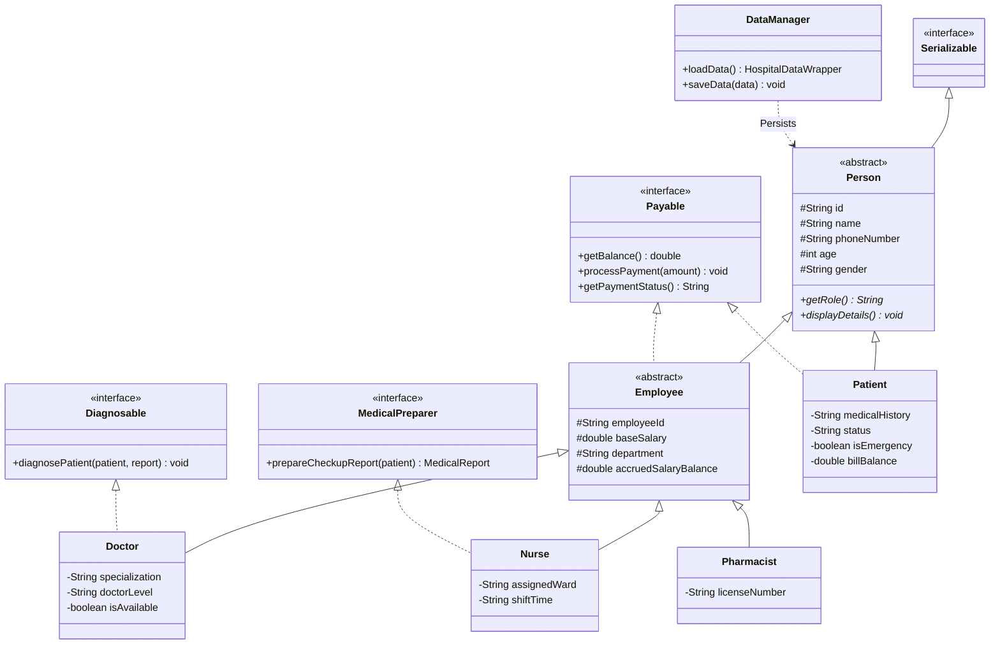

```markdown
# 🏥 Hospital Management System

> A robust, role-based Java application designed around core Object-Oriented Programming (OOP) paradigms, custom exception handling, interface-driven workflows, and automated object serialization persistence.

[](https://www.oracle.com/java/)
[](LICENSE)

---

## 📌 Overview

The **Hospital Management System** models a real-world healthcare ecosystem. It provides an interactive workspace for **Admins, Doctors, Nurses, Pharmacists, and Patients**.

The system automates patient check-in workflows, emergency triage routing, preliminary nurse vitals reports, doctor diagnoses and treatment plans, pharmacy prescription fulfillment, and hospital financial accounting (including bill collections and monthly staff payroll disbursements).

---

## 🏛️ System Architecture & Class Hierarchy



---

## ⚡ Features

### 🔑 Role-Based Access Dashboards

* **👨‍💼 Admin Dashboard:**
* Register new staff members (`Doctor`, `Nurse`, `Pharmacist`) with input validation.
* Create and assign clinical departments.
* Audit hospital central treasury funds.
* Disburse monthly staff salaries.


* **👨‍⚕️ Doctor Dashboard:**
* Review preliminary medical reports generated by nurses.
* Prescribe medications and outline recovery treatments.
* Manage patient bed admissions and discharge authorizations.


* **👩‍⚕️ Nurse Dashboard:**
* Check in arriving patients and assess urgency.
* Measure vital signs (BP, heart rate, temperature) and log symptoms.
* Compile preliminary `MedicalReport` instances for assigned doctors.


* **💊 Pharmacist Dashboard:**
* Manage inventory quantities and prices for `Medicine`.
* Verify doctor prescriptions on medical reports.
* Dispense medications, collect bill payments, and issue receipts.


* **🤒 Patient Dashboard:**
* Check admission/recovery status and view assigned medical team.
* Read detailed medical reports and active prescriptions.
* Pay outstanding hospital and pharmacy bills (`Payable`).


### ⚙️ Core Technical Highlights

* **Emergency Triage Routing:** Automatically bypasses standard intake queues for critical cases, assigning senior doctors and ICU nurses immediately.
* **Decoupled Financials (`Payable`):** Handles transactions cleanly across both revenue collection (patient bills) and expenditure (employee salary withdrawals).
* **Automated Data Persistence:** Uses Java Object Serialization (`DataManager`) to preserve all patient records, inventory states, and financial ledgers to disk (`hospital_data.ser`).
* **Modular Package Architecture:** Clean separation of concerns across `model`, `interfaces`, `exception`, `service`, `util`, and `ui` packages.

---

## 📁 Project Structure

```text
src/
 ├── hospital/
 │    ├── model/                      # Data Entities & Class Hierarchies
 │    │    ├── Person.java            # Abstract Parent Class
 │    │    ├── Employee.java          # Abstract Class for Staff Entities
 │    │    ├── Doctor.java            # Doctor Entity (Level & Specialization)
 │    │    ├── Nurse.java             # Nurse Entity (Ward & Shifts)
 │    │    ├── Pharmacist.java        # Pharmacist Entity (Licensing)
 │    │    ├── Patient.java           # Patient Entity (Vitals & Status)
 │    │    ├── Department.java        # Department Management Entity
 │    │    ├── MedicalReport.java     # Patient Checkup & Prescription Report
 │    │    └── Medicine.java          # Pharmacy Inventory Item
 │    │
 │    ├── interfaces/                 # Role Behavior Contracts
 │    │    ├── Payable.java           # Bills (Patients) & Salaries (Employees)
 │    │    ├── MedicalPreparer.java   # Nurse Preliminary Duties
 │    │    └── Diagnosable.java        # Doctor Diagnostic Duties
 │    │
 │    ├── exception/                  # Custom Exception Hierarchy
 │    │    ├── InvalidInputException.java
 │    │    ├── InsufficientStockException.java
 │    │    ├── InsufficientFundsException.java
 │    │    └── UserNotFoundException.java
 │    │
 │    ├── service/                    # Business & Operations Logic
 │    │    ├── HospitalService.java   # Main Operational Engine
 │    │    ├── PharmacyService.java   # Inventory & Dispensing Engine
 │    │    └── FinanceService.java    # Central Treasury & Payroll Engine
 │    │
 │    ├── util/                       # Utilities & Data Persistence
 │    │    └── DataManager.java       # File Serialization Engine (Save/Load)
 │    │
 │    └── ui/                         # Command Line Interfaces
 │         ├── AdminMenu.java
 │         ├── DoctorMenu.java
 │         ├── NurseMenu.java
 │         ├── PharmacistMenu.java
 │         └── PatientMenu.java
 │
 └── Main.java                        # Application Entry Point

```

---

## 🛠️ Getting Started

### Prerequisites

* **Java Development Kit (JDK):** Version 17 or higher installed.
* **IDE / Terminal:** IntelliJ IDEA, Eclipse, VS Code, or any terminal supporting `javac`.

### Installation & Run Instructions

1. **Clone the Repository:**
```bash
git clone [https://github.com/SulemanAG/hospital-management.git](https://github.com/SulemanAG/hospital-management.git)
cd hospital-management

```


2. **Compile the Source Code:**
```bash
javac -d bin src/hospital/*/*.java src/Main.java

```


3. **Run the Application:**
```bash
java -cp bin Main

```


---

## 🤝 Contributing

Contributions, issues, and feature requests are welcome! Feel free to open an issue or submit a pull request.

---
